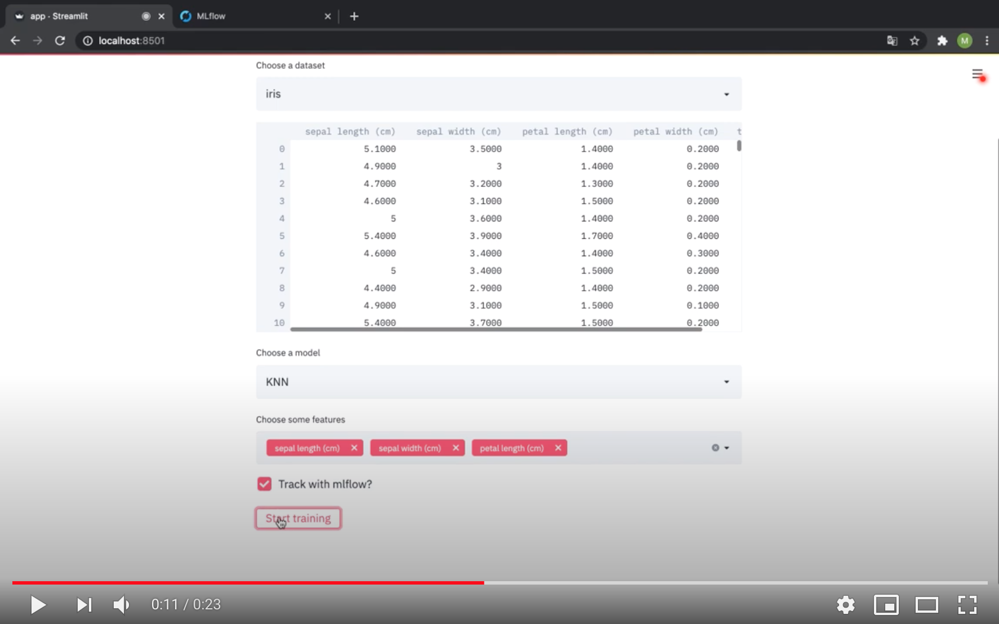

# MLFlow Streamlit Interaction

## Motivation

In this repo I bring together my favorite two Python libraries right now: 
[streamlit](https://github.com/streamlit) and [mlflow](https://github.com/mlflow). 
It is a simple demonstration of how you can use streamlit to experiment 
with various machine learning models and mlflow to keep track of your
experiments. 

Watch [this YouTube video](https://youtu.be/2wEbOmsV028) for a simple
demonstration:

[](https://youtu.be/2wEbOmsV028)

## Try yourself

Step 1: Clone this repository to your local machine
```
git clone git@github.com:mwinterde/mlflow-with-streamlit.git
```

Step 2: Build docker containers for the streamlit and mlflow services.
```
docker-compose build
```

Step 3: Run the services.
```
docker-compose up
```

Step 4: Explore.
* Open http://localhost:8501 to interact with the streamlit app.
* Open http://localhost:5000 to access the mlflow user interface.
